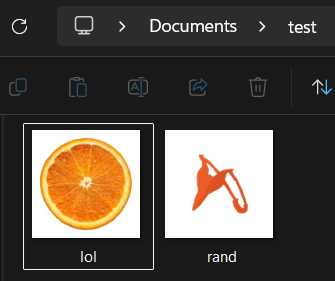
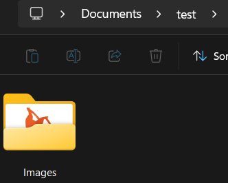

# File Organizer 🪶
File Organizer - a Python CLI tool that automatically sorts files into folders by type
Feeling lazy and overwhelmed by sorting folders and files? Maybe this utility app can help ya out! 💫

---

## Features
 - Organizes files into categorized folders (Images, Documents, Audio, Code, etc)
 - Unmatched file types go into an "Others" folder
 - Skips subfolders automatically
 - Error handling so one bad file doesn't crash the whole app!

---

## DISCLAIMER
Use this at your own risk! This app doesn't take your personal information and privacy! Check the script if you are unsure about this app. 
This moves files on your computer - always test on sample file first before running on anything important! 😼
(files are moved, not copied, so mistakes aren't easily reversible)

---

## Tech Used
 - os (folders path)
 - shutil (moving files)

## How do i run it?
Simply by executing this script, then enter the folder path you want to do! Keep in mind to do this on sample file first. 

---

## DEMO
This is before and after using this. Still unsure? You can always check the script and test it on sample file!

---
Personal notes

### What I learned
I learned some few of how os works, files and also creating and moving files. I love making this program too and learning every line of it!

### Future Improvements
 - Let user Customize
 - Add Undo feature
 - GUI versions
 - Better path finding and error handling

#### LICENSE: MIT
